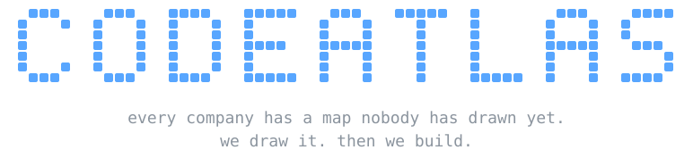

<div align="center">

<a href="https://codeatlas.com.br"></a>

<sub>📍 lat −25.43 · lon −49.27 · curitiba, brasil &nbsp;|&nbsp; building <a href="https://github.com/codeatlasdev">@codeatlasdev</a> with <a href="https://github.com/luancoleto">@luancoleto</a> &nbsp;|&nbsp; shipping in the open at <a href="https://github.com/vkdprojects">@vkdprojects</a></sub>

</div>

<p align="center"></p>

> **luan maps the territory. i make sure what we build on it holds up.**
> once the problem is clear, i'm the one turning it into something real:
> the system, the automation, the agent, the infra underneath. built to last, not to demo.

### ⚙️ how i build

<p align="center"> &nbsp;→&nbsp;  &nbsp;→&nbsp;  &nbsp;→&nbsp;  &nbsp;→&nbsp; </p>

<p align="center"><b>quality is the only constraint.</b> time, complexity and scope don't get a vote.</p>

<p align="center"></p>

### 👤 me, on this map

```console
$ whoami
matheus vilaça · codeatlas · curitiba, brasil

$ cat now.txt
> building systems, automations and AI agents for clients @codeatlasdev
> shipping in the open @vkdprojects (100% open source, come hang)
> open to work with people anywhere. pt-br / english
```

<details>
<summary><b>🥚 faq nobody asked</b></summary>

<br>

**fav language?** whichever one the problem asks for. that's kinda the whole point

**why is your public graph so quiet?** most of my work lives in private client repos. the public graph only shows a fraction of it 👀

</details>

<p align="center"></p>

<picture>
  <source media="(prefers-color-scheme: dark)" srcset="https://raw.githubusercontent.com/mvilacad/mvilacad/output/snake-dark.svg">
  
</picture>

<p align="center"><sub>2,370 contributions in the last year · mostly private client work · the snake refreshes every 12h</sub></p>

<div align="center">

**got something that has to actually work? let's build it.**

[](https://codeatlas.com.br)
[](mailto:matheus@codeatlas.com.br)
[](https://www.linkedin.com/in/matheus-vila%C3%A7a-de-jesus-679417323/)
[](https://github.com/codeatlasdev)
[](https://github.com/vkdprojects)

</div>
